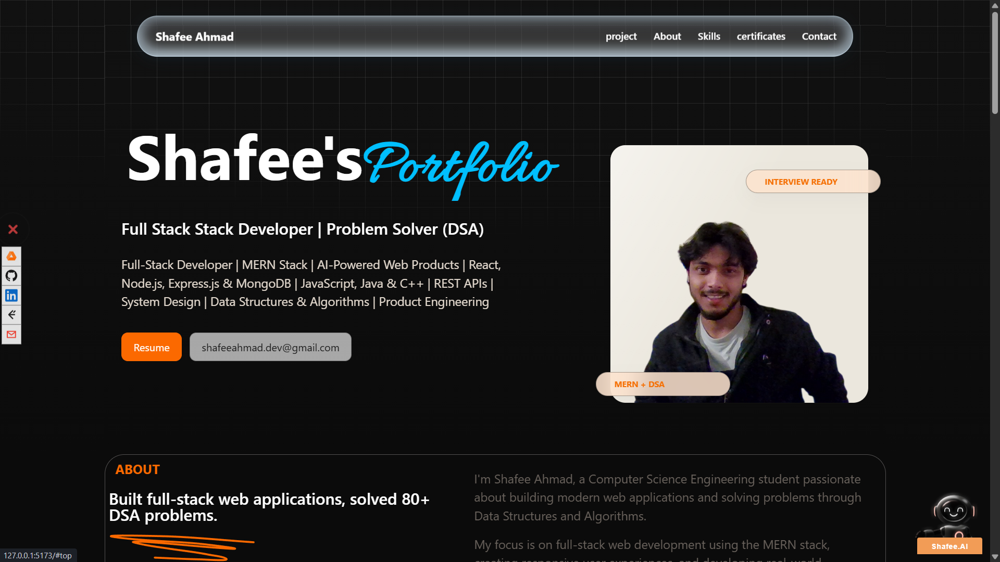
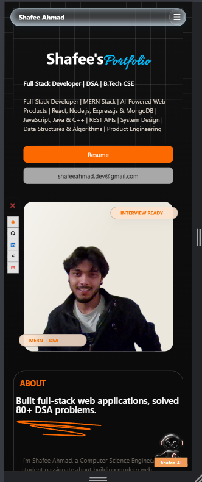

# 🚀 Shafee Ahmad | Portfolio


A premium full-stack developer portfolio built with **React**, **Vite**, **Node.js**, and modern animation libraries.

Designed with performance, accessibility, scalability, and developer experience in mind.

---

## ✨ Live Demo

🌐 Portfolio: https://www.shafee.in

---


## Desktop Preview



## Mobile Preview



---

# ✨ Features

## Modern UI

- Premium landing page
- Responsive on all devices
- Glassmorphism design
- Smooth scrolling
- Dark theme
- Interactive cards
- Beautiful typography

---

## Animations

- GSAP animations
- Framer Motion transitions
- Scroll-triggered effects
- Hover interactions
- Loading animations
- Section reveals

---

## AI Assistant

Custom-built portfolio assistant capable of answering questions about:

- About Me
- Skills
- Projects
- Resume
- Education
- Experience
- Contact

Supports:

- Keyword detection
- Suggestion chips
- Typing animation
- Dynamic responses

---

## LeetCode Integration

Backend API fetches live LeetCode statistics.

Displays:

- Problems solved
- Easy / Medium / Hard
- Ranking
- Profile link

---

## Backend

Express server provides APIs for:

- Chat assistant
- LeetCode stats
- Future AI integrations

---

# 🛠 Tech Stack

## Frontend

- React
- Vite
- JavaScript
- CSS3
- GSAP
- Framer Motion

## Backend

- Node.js
- Express.js
- Axios

## Deployment

- Vercel
- Render

---

# 📂 Project Structure

```
portfolio/
│
├── src/
│   ├── assets/
│   ├── components/
│   ├── pages/
│   ├── hooks/
│   ├── context/
│   ├── utils/
│   └── App.jsx
│
├── backend/
│   ├── src/
│   ├── routes/
│   ├── services/
│   └── app.js
│
├── public/
└── README.md
```

---

# 🚀 Getting Started

## Clone

```bash
git clone https://github.com/SHAFEE12/portfolio2.git
```

Move into project

```bash
cd portfolio2
```

Install frontend

```bash
npm install
```

Run frontend

```bash
npm run dev
```

---

## Backend

Move to backend

```bash
cd backend
```

Install dependencies

```bash
npm install
```

Start server

```bash
npm run dev
```

---

# ⚙ Environment Variables

Frontend

```env
VITE_API_URL=http://localhost:5000
```

Backend

```env
PORT=5000
NODE_ENV=development

FRONTEND_URL=http://localhost:5173

LEETCODE_USERNAME=YOUR_USERNAME
```

---

# 📈 Performance Goals

- Lighthouse 95+
- Optimized assets
- Lazy loading
- Code splitting
- Responsive images
- Fast initial load
- SEO-friendly metadata

---

# 💻 Developer Experience

- Clean architecture
- Reusable components
- Feature-based structure
- Modular design
- Scalable codebase
- Easy maintenance

---

# 🔮 Upcoming Features

- Blog
- Admin Dashboard
- AI Resume Analyzer
- Project CMS
- GitHub Analytics
- Contact Dashboard


---

# 🤝 Contributing

Contributions are welcome.

1. Fork the repository
2. Create a feature branch

```bash
git checkout -b feature/new-feature
```

3. Commit

```bash
git commit -m "Add new feature"
```

4. Push

```bash
git push origin feature/new-feature
```

5. Open a Pull Request

---

# 📬 Contact

**Shafee Ahmad**

Portfolio:
https://www.shafee.in

GitHub:
https://github.com/SHAFEE12

LinkedIn:
https://www.linkedin.com/in/shafee-ahmad-683236305

Email:
shafeeahmad.dev@gmail.com

---

# ⭐ Show your support

If you like this project, please consider giving it a ⭐ on GitHub.

It helps others discover the project and motivates further improvements.

---

